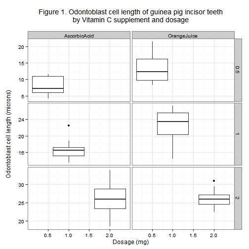

####Data Science Specialism

#####Module 6 - Statistical Inference (June 2015)

##Length of odontoblast cells in <i>Cavia porcellus </i> (guinea pig) incisor teeth with reference to Vitamin C.

###Author: Fiona Young

####Submission date: 18 June 2012

--------------------------------------------------

####SUMMARY

To analyse the data we used a t-test for matched pairs with a 95% confidence interval.  The null hypothesis stated that at any dosage for orange juice and ascorbic acid there would be no difference in length of odontoblast cells in the guinea pig incisor teeth.

For a 0.5 mg dosage we rejected the null hypothesis as  orange juice had a greater effect on odontoblast cell length than ascorbic acid with a 95% confidence interval of 5.25 mg +/- 10.2 mg with a P-value of 0.015.  At the 1.0 mg we also rejected the null hypothesis with a 95% confidence interval of 5.93 mg +/- 10.9 mg at a P-value of 0.008.  The final dosage of 2.0 mg we accepted the null hypothesis where there was no difference between orange juice or ascorbic acid on odontoblast cell length.  For this test there was a 95% confidence interval of 4.12 mg +/- 0.15 mg with a P-value of 0.967.

--------------------------------------------------

####INTRODUCTION

<i>Cavia porcellus</i> or the guinea pig/cavy is a domesticated animal of Order Rodentia, family Caviidae (Wikipedia 2015a). An animal can live between five to seven years and as long as nine years (Guinea Lynx 2015a).  It is a typical rodent where the top and bottom incisor teeth continually grow thoroughout the lifespan of the animal, hence the urge to constantly gnaw.  The guinea pig used to be a model organism for experiments but has been replaced by mice and rats (Wikipedia 2015b).

Vitamin C is "derived from glucose so many non-human animals are able to produce it, but guinea pigs lack the ability to produce Vitamin C so it must be added to their diet as a supplement" (Wikipedia 2015c).  The average guinea pig requires 10 to 30 mg per kilogram body weight per day.  Without Vitamin C the disease scurvy results.  The symptoms of which are lethargy, hopping instead of walking, refusal to eat, diarrhoea, discharges from eyes and nose, rough coat, poor flesh condition, tenderness to touch and internal skeletal-muscular hemorrhage (Guinea Lynx 2000b).  Without Vitamin C growth of all tissues is greatly reduced including the growth of odontoblast cells that are responsible for increasing tooth length.

In this analysis we are to revisit the analysis in Crampton (1947) using a partial dataset that is held in the R datasets library package (CRAN 2015).

Normally our null hypothesis would state that Vitamin C given in either as ascorbic acid or orange juice will have no effect on the length of odontoblast cells in Guinea pig incisor teeth however, there is no control samples i.e. guinea pigs given no Vitamin C as this would breach research experimental ethics and be seriously detrimental of guinea pig health.

Therefore the null hypothesis is that Vitamin C given in a supplement as either ascorbic acid or orange juice at a particular dosage have the same effect on the length of odontoblast cells of guinea pig incisor teeth.

--------------------------------------------------

####METHODOLOGY / DATA PROCESSING

Vitamin C in 0.5, 1 or 2 mg dosages was given to 10 guinea pigs as either ascorbic acid or orange juice.

To analyse the data we calculated the sample means, variances and standard deviations shown in tables 1 to 3 and plotted a graph (figure 1) to demonstrate the differences between the six samples (see appendix for R script).

To test the hypothesis we used the t-test for matched pairs using the 95% confidence interval where the mean values of each supplement sample were compared to each other.  To use the t-test we use the following assumptions:

no more than 30 variables for each sample group;
sample measurements are numeric;
the samples come from a single normal population density function (e.g. matched samples - all guinea pigs and odontoblast cells from top and bottom incisor teeth).

--------------------------------------------------

RESULTS

As the dosage increases the odontoblast cell length increases for both supplement types (appendix - table 1).  Although both peak at 26 microns at the 2 mg dose the ascorbic acid values have risen faster than orange juice values.

The variance values increase for ascorbic acid but decreases for the orange juice supplement (appendix - table 2).

The standard deviation remains approximately the same for ascorbic acid although it rises for the 2 mg dosage.  For the orange juice dosage the standard deviation value reduces (appendix - table 3).


```r
##GRAPH
boxy
```

 

Figure 1 demonstrates the same information as shown in Tables 1 to 3 but in a graphic format.  Note the differences in the y axis (odontoblast cell length) as this displays the boxplots at a better scale to appreciate the differences between each of the six samples.

Referring back to the null hypothesis that Vitamin C given in a supplement as either ascorbic acid or orange juice at a particular dosage has the same effect on the length of odontoblast cells of guinea pig incisor teeth.  Can we uphold the null hypothesis for each of the dosages?  Typically the 95% confidence level is used in biological statistically testing and that will be used for this analysis.

Can the null hypothesis be rejected at the 0.5 mg dosage?  With a mean of the sample differences at -5.25 and a critical value t-score is -2.9791 at 9 df (degrees of freedom) the 5% significant level / 95% confidence interval (CI) is -9.236542 for the lower tail and -1.263458 for the upper tail.  As the t-score value is larger than the upper confidence interval the null hypothesis can be rejected therefore orange juice has a greater effect on odontoblast cell length than ascorbic acid.  How certain can we be that we have not made a Type I Error is P-value 0.01547.  It is very unlikely with a 1 in 150 chance (see appendix - table 4).
 
What is the margin of error for the confidence intervals? For both upper and lower CI values: margin of error = critical value - standard error (SE) where the critical value = t-score value = -2.9791 and SE = square root(variance sample A / number of samples in A) + (variance sample B / number of samples in B) (see table 2 for the variance values) thus sqrt((7.544/10) + (19.889/10)).  Therefore margin of error in the lower and upper confidence intervals:


```r
-5.25 - (-2.9791 * sqrt((7.544/10) + (19.889/10)))
```

```
## [1] -0.3157434
```

```r
-5.25 + (-2.9791 * sqrt((7.544/10) + (19.889/10)))
```

```
## [1] -10.18426
```

The 95% Confidence Interval and margin of error is 5.25 mg +/- 10.2 mg

Can the null hypothesis be rejected at the 1.0 mg dosage?

Using the same calculations used in the 0.5 mg dosage above (see table 2 for the variance values):

The mean sample differences is -5.93, the critical t-score is -3.3721 at 9 df with a 5% significant level / 95% confidence interval is -9.908089 for the lower tail and -1.951911 for the upper tail.  As the t-score (3.3721) is larger than the upper tail value of 1.951911 the null hypothesis can be rejected thereby stating the alternative hypothesis that orange juice has a greater effect on odontoblast cell length than ascorbic acid. How certain can we be that we have not made a Type 1 Error is shown by the P-value of 0.008229.  Is it extremely unlikely with 1 in 8000 chance (see appendix - table 5). What is the margin of error for the confidence intervals at 1.0 mg dosage? Using the same calculations used in t-test 0.5 mg dosage with a critical t-score of -3.3721 gives an SE value of sqrt((6.326778/10) + (15.295556 /10)).  So margin of error of lower and upper CI is:


```r
-5.93 - (-3.3721 * sqrt((6.326778/10) + (15.295556 /10)))
```

```
## [1] -0.9714839
```

```r
-5.93 + (-3.3721 * sqrt((6.326778/10) + (15.295556 /10)))
```

```
## [1] -10.88852
```

The 95% Confidence Interval and margin of error is 5.93 mg +/- 10.9 mg

Can we reject the null hypothesis at the 2.0 mg dosage?

Again using the same calculations as in t-test 0.5 mg dosage (see table 2 for the variance values):

The mean sample differences is 0.08, the critical t-score is 0.042592 at 9 df with a 5% significant level / 95% confidence level is -4.168976 for the lower tail and 4.328976 for the uppper tail.  As the t-score (0.08) is smaller than the upper 95% CI (4.328976) the null hypothesis cannot be rejected.  Therefore there is no difference between odontoblast cell length at the 2 mg dosage using either ascorbic acid or orange juice.  Have we made a Type 1 error? With a P-value of 0.967 there is a possibility that we should in fact accept the alternative hypothesis (see appendix - table 6).  What is the CI margin of error at the 2.0 mg dosage?  Again we use the same calculations used in t-test 0.5 mg dosage with a critical t-score of 0.042592 gives an SE value of (sqrt((23.018222/10) + (7.049333/10)), where the margins of error at the lower and upper CI is:


```r
0.08 - (0.042592 * sqrt((23.018222/10) + (7.049333/10)))
```

```
## [1] 0.006145478
```

```r
0.08 + (0.042592 * sqrt((23.018222/10) + (7.049333/10)))
```

```
## [1] 0.1538545
```

The 95% confidence interval and margin of error at the 2.0 mg dosage is 4.12 mg +/- 0.15 mg

--------------------------------------------------

####CONCLUSION

Did the length of odontoblast cells in guinea pig incisor teeth change when Vitamin C was given in a supplement of either ascorbic acid or orange juice at three doses?

To analyse the data we used the t-test for matched pairs using the 95% confidence interval where the mean values of each supplement sample were compared to each other.

At the 0.5 mg dose orange juice had a greater effect on odontoblast cell length than ascorbic acid at the 95% confidence interval of 5.25 mg +/- 10.2 mg. With a probability value of 0.015 we can be confident that we have not made a Type 1 error.
	
For the 1.0 mg dosage orange juice had a greater effect on the odontoblast cell length than ascorbic acid with a 95% confidence interval of 5.93 mg +/- 10.9 mg. With a Type 1 error probability at 0.008 it is extremely unlikely we have accepted the alternative hypothesis incorrectly.

The final dosage level of 2.0 mg we could not reject the null hypothesis as the t-score of 0.08 was smaller than the 95% with a confidence interval of 4.12 mg +/- 0.15 mg.  There is a probability of a Type 1 error at the P-value of 0.967 so there is no possibility of making the error of accepting the alternative hypothesis.

--------------------------------------------------

####APPENDIX


```r
##1 - loading libraries	   
library(datasets)
library(stringr)
library(stats)
library(reshape2)
library(ggplot2)
library(dplyr)
library(knitr)
library(rmarkdown)

##NOTE - for knitr/rmarkdown to work in RCONSOLE you are required to download the PANDOC package available online at: http://pandoc.org/installing.html
```

--------------------------------------------------


```r
##1.1 - What hardware/software environment am I using for this analysis?
sessionInfo()
```

```
## R version 3.2.0 (2015-04-16)
## Platform: x86_64-w64-mingw32/x64 (64-bit)
## Running under: Windows 8 x64 (build 9200)
## 
## locale:
## [1] LC_COLLATE=English_United Kingdom.1252 
## [2] LC_CTYPE=English_United Kingdom.1252   
## [3] LC_MONETARY=English_United Kingdom.1252
## [4] LC_NUMERIC=C                           
## [5] LC_TIME=English_United Kingdom.1252    
## 
## attached base packages:
## [1] stats     graphics  grDevices utils     datasets  methods   base     
## 
## other attached packages:
## [1] rmarkdown_0.6.1 knitr_1.10.5    dplyr_0.4.1     ggplot2_1.0.1  
## [5] reshape2_1.4.1  stringr_1.0.0  
## 
## loaded via a namespace (and not attached):
##  [1] Rcpp_0.11.6      assertthat_0.1   digest_0.6.8     MASS_7.3-40     
##  [5] grid_3.2.0       plyr_1.8.2       gtable_0.1.2     DBI_0.3.1       
##  [9] formatR_1.2      magrittr_1.5     evaluate_0.7     scales_0.2.4    
## [13] stringi_0.4-1    labeling_0.3     proto_0.3-10     tools_3.2.0     
## [17] munsell_0.4.2    parallel_3.2.0   colorspace_1.2-6 htmltools_0.2.6
```

--------------------------------------------------


```r
##2 - creating a dataset for analysis
dataset <- ToothGrowth

##3 - explore the dataset

##3.1 - what the dataset contains
str(dataset)
```

```
## 'data.frame':	60 obs. of  3 variables:
##  $ len : num  4.2 11.5 7.3 5.8 6.4 10 11.2 11.2 5.2 7 ...
##  $ supp: Factor w/ 2 levels "OJ","VC": 2 2 2 2 2 2 2 2 2 2 ...
##  $ dose: num  0.5 0.5 0.5 0.5 0.5 0.5 0.5 0.5 0.5 0.5 ...
```

```r
##4 - The dataset consists of three columns: len, supp and dose in 60 rows.  To make the dataset easier to read the column headers and supplement types will be renamed.

##4.1 - renaming the column header for easier understanding
names(dataset) <- gsub("len", "odontoblast.length.in.microns", names(dataset))
names(dataset) <- gsub("supp", "supplement.type", names(dataset))
names(dataset) <- gsub("dose", "dosage.amount.in.mg", names(dataset))

##4.2 - renaming OJ and VC row variables
dataset$supplement.type = ifelse(dataset$supplement.type == "VC", "AscorbicAcid", dataset$supplement.type)
dataset$supplement.type = ifelse(dataset$supplement.type == "1", "OrangeJuice", dataset$supplement.type)
```

--------------------------------------------------

Calculating the mean, variance and standard deviation of each dosage by supplement type.


```r
##1 - calculating by supplement and dosage
melted <- melt(dataset, id.vars = c("supplement.type", "dosage.amount.in.mg"))
calculatedmeans <- dcast(melted, supplement.type ~ dosage.amount.in.mg, mean)
colnames(calculatedmeans) <- c("supplement type", "0.5 mg dose", "1 mg dose", "2 mg dose")

##2 - variance by supplement and dosage
calculatedvariance <- dcast(melted, supplement.type ~ dosage.amount.in.mg, var)
colnames(calculatedvariance) <- c("supplement.type", "0.5 mg dose", "1 mg dose", "2 mg dose")

##3 - standard deviation by supplement and dosage
calculatedsd <- dcast(melted, supplement.type ~ dosage.amount.in.mg, sd)
colnames(calculatedsd) <- c("supplement type", "0.5 mg dose", "1 mg dose", "2 mg dose")
```


```r
##1 - mean, variance and standard deviation

##1.1 - mean by supplement and dosage
calculatedmeans
```

```
##   supplement type 0.5 mg dose 1 mg dose 2 mg dose
## 1    AscorbicAcid        7.98     16.77     26.14
## 2     OrangeJuice       13.23     22.70     26.06
```

Table 1. Mean of odontoblast cell length by supplement and dosage regime


```r
	##1.2 - variance by supplement and dosage
	calculatedvariance
```

```
##   supplement.type 0.5 mg dose 1 mg dose 2 mg dose
## 1    AscorbicAcid       7.544  6.326778 23.018222
## 2     OrangeJuice      19.889 15.295556  7.049333
```
Table 2. Variance of odontoblast cell length by supplement and dosage regime


```r
		##1.3 - standard deviation by supplement and dosage
		calculatedsd
```

```
##   supplement type 0.5 mg dose 1 mg dose 2 mg dose
## 1    AscorbicAcid    2.746634  2.515309  4.797731
## 2     OrangeJuice    4.459709  3.910953  2.655058
```

Table 3. Standard deviation of odontoblast cell length by supplement and dosage regime


```r
##1 - Boxplot of odontoblast cell length vs Vitamin C supplement and dosage
boxy <- ggplot(data = dataset) +
geom_boxplot(aes(y = odontoblast.length.in.microns, x = dosage.amount.in.mg)) +
facet_grid(dosage.amount.in.mg ~ supplement.type,  
scales = "free") + 
theme_bw() +
labs(list(title = "Figure 1. Odontoblast cell length of guinea pig incisor teeth\nby Vitamin C supplement and dosage\n", x = "Dosage (mg)", y = "Odontoblast cell length (microns)\n"))
```


```r
##HYPOTHESIS TESTING USING MATCHED PAIRS T-TEST - between the means of each group for each dosage level

##The variances are difference therefore using the command var.equal = FALSE

##1 - t-test for matched pairs - dosage 0.5mg
t.test(dataset$odontoblast.length.in.microns[c(1:10)],   dataset$odontoblast.length.in.microns[c(31:40)], conf.level = 0.95, paired = TRUE, var.equal = FALSE, alternative = "two.sided")
```

```
## 
## 	Paired t-test
## 
## data:  dataset$odontoblast.length.in.microns[c(1:10)] and dataset$odontoblast.length.in.microns[c(31:40)]
## t = -2.9791, df = 9, p-value = 0.01547
## alternative hypothesis: true difference in means is not equal to 0
## 95 percent confidence interval:
##  -9.236542 -1.263458
## sample estimates:
## mean of the differences 
##                   -5.25
```

Table 4. Output of the t-test for the 0.5 mg dosage


```r
##2 - t-test for matched pairs - dosage 1.0 mg
t.test(dataset$odontoblast.length.in.microns[c(11:20)], dataset$odontoblast.length.in.microns[c(41:50)], conf.level = 0.95, paired = TRUE, var.equal = FALSE)
```

```
## 
## 	Paired t-test
## 
## data:  dataset$odontoblast.length.in.microns[c(11:20)] and dataset$odontoblast.length.in.microns[c(41:50)]
## t = -3.3721, df = 9, p-value = 0.008229
## alternative hypothesis: true difference in means is not equal to 0
## 95 percent confidence interval:
##  -9.908089 -1.951911
## sample estimates:
## mean of the differences 
##                   -5.93
```
Table 5. Output of the t-test for the 1.0 mg dosage


```r
##3 - t-test for matched pairs - dosage 2.0 mg
t.test(dataset$odontoblast.length.in.microns[c(21:30)], dataset$odontoblast.length.in.microns[c(51:60)], conf.level = 0.95, paired = TRUE, var.equal = FALSE)
```

```
## 
## 	Paired t-test
## 
## data:  dataset$odontoblast.length.in.microns[c(21:30)] and dataset$odontoblast.length.in.microns[c(51:60)]
## t = 0.042592, df = 9, p-value = 0.967
## alternative hypothesis: true difference in means is not equal to 0
## 95 percent confidence interval:
##  -4.168976  4.328976
## sample estimates:
## mean of the differences 
##                    0.08
```
Table 6. Output of the t-test for the 2.0 mg dosage

--------------------------------------------------

####REFERENCES

http://cran.r-project.org/ (2015) Tooth Growth from the R library(datasets), R Documentation accessed at 15:16 on 7 June 2015 from  http://127.0.0.1:27055/library/datasets/html/ToothGrowth.html

C. I. Bliss (1952) The Statistics of Bioassay. Academic Press.

McNeil D R (1977) Interactive Data Analysis. New York: Wiley.
Examples

Wikipedia (2015c) Ascorbic acid accessed at 14:45 on 12 June 2015 from https://en.wikipedia.org/wiki/Ascorbic_acid

Crampton E W (1947) The growth of the odontoblasts of the incisor tooth as a criterion of the Vitamin C intake of the Guinea Pig, Journal of Nutrition, pp 491 - 504

Guinea Lynx (2000a) Raising a healthy guinea pig accessed at 11:00 on 13 June 2015 from http://www.guinealynx.info/healthycavy.html

Guinea Lynx (2000b) Vitamin C deficiency accessed at 14:50 on 12 June 2015 from http://www.guinealynx.info/scurvy.html

Wikipedia (2015a) Guinea pig accessed at 11:08 on 13 June 2015 from https://en.wikipedia.org/wiki/Guinea_pig

Wikipedia (2015b) Rodent accessed at 11:05 on 13 June 2015 from https://en.wikipedia.org/wiki/Rodent


knit2html("project2.Rmd")

