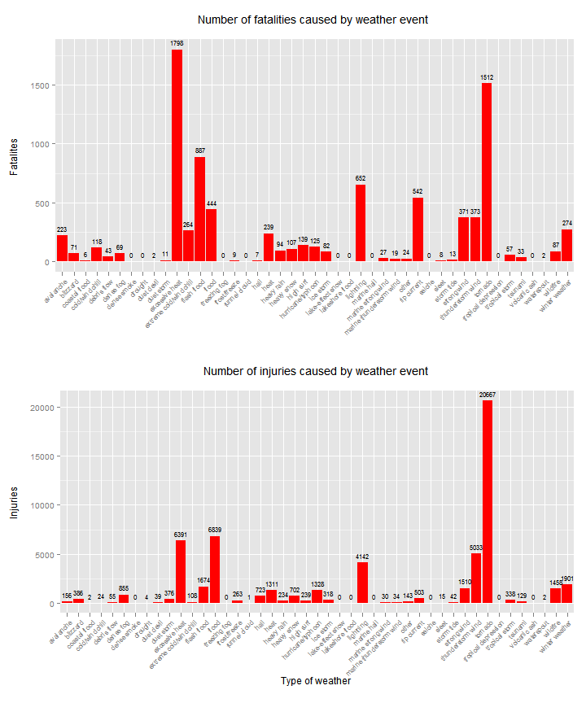
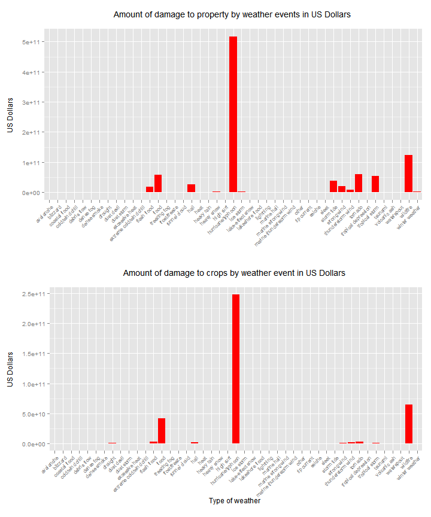

####Data Science Specialism

#####Module 5 (Project Two - Reproducible research (May 2015)

##U.S.A. weather phenomena (January 1996 to November 2011) and its effects on population health and damage to property and crops.

###Author/Data Analyst: Fiona Young


####SUMMARY

	This report addresses two questions 1. which types of weather event/s are most harmful to human life and 2. which weather event/s are most costly to property and crops.

	In order to answers these objectives, US Storm Data collected by NOAA, the National Oceanic & Atmospheric Administration from 1950 to 2011 was processed and analysed.  Only data from 1996 to 2011 contained all 48 weather events described by NOAA and it was these years that were selected.
	
	On examination the raw data contained 37 columns with 902,297 rows of which nine columns were selected for analysis (date, state, eventtype, fatalities, injuries, property value & EXP and crop value & EXP.  With the reduction of years and rows with missing data resulted in 653,454 rows remaining.
	
	A great deal of data preprocessing was required to amalgamate the large number of weather events into the 48 due to multiple spellings, brackets, 'and' or '&' or '/' and those events that did not fit other categories were placed in 'other'.
	
	This analysis demonstrated that biggest causes of human death was excessive heat with 1,798 and 20,667 human injuries by tornados.  Economically hurricane/typhoons were the main cause for both property and crop damage with USD 517 billion and USD 247 billion respectively.
	
	By year the largest number of fatalities and injuries were caused by tornado in 2011 with 587 and 6,163 respectively whereas by state 158 human fatalities were caused by tornado in Missouri and 6,339 injuries from flood in Texas.

####METHODOLOGY / DATA PROCESSING

	In order to process the raw data set (NOAA 2011a) eight packages required loading into R and they are:

	data.table, dplyr, reshape2, ggplot2, grid, gridExtra, knitr and rmarkdown.

	To produce output files of .md and .html within the R Console the additional package Pandoc was downloaded and installed (Pandoc 2006).


```r
##1 - loading R libraries (these have been previously downloaded using R itself by typing install.packages("library name here"). Select your CRAN server to download package.

library(data.table)
library(dplyr)
library(reshape2)
library(ggplot2)
library(grid)
library(gridExtra)
library(knitr)
library(rmarkdown)
```

	It is important to note what hardware/software environment was used during this analysis as R packages may become part of the R Base software and may not require loading in the future.  Also note the versions of the packages loaded as these will definitely be updated by their authors and commands may be subjected to alterations.  There may be differences in processing between Windows / Mac / Linux operating systems.


```r
	##1.2 - What hardware/software environment am I using for this analysis?
	sessionInfo()
```

```
## R version 3.2.0 (2015-04-16)
## Platform: x86_64-w64-mingw32/x64 (64-bit)
## Running under: Windows 8 x64 (build 9200)
## 
## locale:
## [1] LC_COLLATE=English_United Kingdom.1252 
## [2] LC_CTYPE=English_United Kingdom.1252   
## [3] LC_MONETARY=English_United Kingdom.1252
## [4] LC_NUMERIC=C                           
## [5] LC_TIME=English_United Kingdom.1252    
## 
## attached base packages:
## [1] grid      stats     graphics  grDevices utils     datasets  methods  
## [8] base     
## 
## other attached packages:
## [1] rmarkdown_0.6.1  knitr_1.10       gridExtra_0.9.1  ggplot2_1.0.1   
## [5] reshape2_1.4.1   dplyr_0.4.1      data.table_1.9.4
## 
## loaded via a namespace (and not attached):
##  [1] Rcpp_0.11.6      magrittr_1.5     MASS_7.3-40      munsell_0.4.2   
##  [5] colorspace_1.2-6 stringr_1.0.0    plyr_1.8.2       tools_3.2.0     
##  [9] parallel_3.2.0   gtable_0.1.2     DBI_0.3.1        htmltools_0.2.6 
## [13] assertthat_0.1   digest_0.6.8     formatR_1.2      evaluate_0.7    
## [17] labeling_0.3     stringi_0.4-1    scales_0.2.4     chron_2.3-45    
## [21] proto_0.3-10
```

	The raw dataset required downloading via Cloudfront.net (NOAA 2011a).  As it was a zipped file it required unzipping which was completed during reading the file into .csv file type.


```r
		##1.3 - get the data from the internet!
		download.file("http://d396qusza40orc.cloudfront.net/repdata%2Fdata%2FStormData.csv.bz2", "stormdata.csv.bz2")
			
				##1.4 - unzipping and loading the entire dataset into R to view dataset.
				dataset <- read.csv(bzfile("stormdata.csv.bz2"))
```

	Before analysis it was important to examine the raw data as not all of it will be required for this analysis.


```r
##2 - what does the dataset contain?

	##2.1 - the number of rows and columns?
	dim(dataset)
```

```
## [1] 902297     37
```

```r
		##2.2 - the column headings and their data classes?
		str(dataset)
```

```
## 'data.frame':	902297 obs. of  37 variables:
##  $ STATE__   : num  1 1 1 1 1 1 1 1 1 1 ...
##  $ BGN_DATE  : Factor w/ 16335 levels "1/1/1966 0:00:00",..: 6523 6523 4242 11116 2224 2224 2260 383 3980 3980 ...
##  $ BGN_TIME  : Factor w/ 3608 levels "00:00:00 AM",..: 272 287 2705 1683 2584 3186 242 1683 3186 3186 ...
##  $ TIME_ZONE : Factor w/ 22 levels "ADT","AKS","AST",..: 7 7 7 7 7 7 7 7 7 7 ...
##  $ COUNTY    : num  97 3 57 89 43 77 9 123 125 57 ...
##  $ COUNTYNAME: Factor w/ 29601 levels "","5NM E OF MACKINAC BRIDGE TO PRESQUE ISLE LT MI",..: 13513 1873 4598 10592 4372 10094 1973 23873 24418 4598 ...
##  $ STATE     : Factor w/ 72 levels "AK","AL","AM",..: 2 2 2 2 2 2 2 2 2 2 ...
##  $ EVTYPE    : Factor w/ 985 levels "   HIGH SURF ADVISORY",..: 834 834 834 834 834 834 834 834 834 834 ...
##  $ BGN_RANGE : num  0 0 0 0 0 0 0 0 0 0 ...
##  $ BGN_AZI   : Factor w/ 35 levels "","  N"," NW",..: 1 1 1 1 1 1 1 1 1 1 ...
##  $ BGN_LOCATI: Factor w/ 54429 levels "","- 1 N Albion",..: 1 1 1 1 1 1 1 1 1 1 ...
##  $ END_DATE  : Factor w/ 6663 levels "","1/1/1993 0:00:00",..: 1 1 1 1 1 1 1 1 1 1 ...
##  $ END_TIME  : Factor w/ 3647 levels ""," 0900CST",..: 1 1 1 1 1 1 1 1 1 1 ...
##  $ COUNTY_END: num  0 0 0 0 0 0 0 0 0 0 ...
##  $ COUNTYENDN: logi  NA NA NA NA NA NA ...
##  $ END_RANGE : num  0 0 0 0 0 0 0 0 0 0 ...
##  $ END_AZI   : Factor w/ 24 levels "","E","ENE","ESE",..: 1 1 1 1 1 1 1 1 1 1 ...
##  $ END_LOCATI: Factor w/ 34506 levels "","- .5 NNW",..: 1 1 1 1 1 1 1 1 1 1 ...
##  $ LENGTH    : num  14 2 0.1 0 0 1.5 1.5 0 3.3 2.3 ...
##  $ WIDTH     : num  100 150 123 100 150 177 33 33 100 100 ...
##  $ F         : int  3 2 2 2 2 2 2 1 3 3 ...
##  $ MAG       : num  0 0 0 0 0 0 0 0 0 0 ...
##  $ FATALITIES: num  0 0 0 0 0 0 0 0 1 0 ...
##  $ INJURIES  : num  15 0 2 2 2 6 1 0 14 0 ...
##  $ PROPDMG   : num  25 2.5 25 2.5 2.5 2.5 2.5 2.5 25 25 ...
##  $ PROPDMGEXP: Factor w/ 19 levels "","-","?","+",..: 17 17 17 17 17 17 17 17 17 17 ...
##  $ CROPDMG   : num  0 0 0 0 0 0 0 0 0 0 ...
##  $ CROPDMGEXP: Factor w/ 9 levels "","?","0","2",..: 1 1 1 1 1 1 1 1 1 1 ...
##  $ WFO       : Factor w/ 542 levels ""," CI","$AC",..: 1 1 1 1 1 1 1 1 1 1 ...
##  $ STATEOFFIC: Factor w/ 250 levels "","ALABAMA, Central",..: 1 1 1 1 1 1 1 1 1 1 ...
##  $ ZONENAMES : Factor w/ 25112 levels "","                                                                                                                               "| __truncated__,..: 1 1 1 1 1 1 1 1 1 1 ...
##  $ LATITUDE  : num  3040 3042 3340 3458 3412 ...
##  $ LONGITUDE : num  8812 8755 8742 8626 8642 ...
##  $ LATITUDE_E: num  3051 0 0 0 0 ...
##  $ LONGITUDE_: num  8806 0 0 0 0 ...
##  $ REMARKS   : Factor w/ 436781 levels "","-2 at Deer Park\n",..: 1 1 1 1 1 1 1 1 1 1 ...
##  $ REFNUM    : num  1 2 3 4 5 6 7 8 9 10 ...
```

```r
			##2.3 - the first 5 rows of data
			head(dataset, 5)
```

```
##   STATE__           BGN_DATE BGN_TIME TIME_ZONE COUNTY COUNTYNAME STATE
## 1       1  4/18/1950 0:00:00     0130       CST     97     MOBILE    AL
## 2       1  4/18/1950 0:00:00     0145       CST      3    BALDWIN    AL
## 3       1  2/20/1951 0:00:00     1600       CST     57    FAYETTE    AL
## 4       1   6/8/1951 0:00:00     0900       CST     89    MADISON    AL
## 5       1 11/15/1951 0:00:00     1500       CST     43    CULLMAN    AL
##    EVTYPE BGN_RANGE BGN_AZI BGN_LOCATI END_DATE END_TIME COUNTY_END
## 1 TORNADO         0                                               0
## 2 TORNADO         0                                               0
## 3 TORNADO         0                                               0
## 4 TORNADO         0                                               0
## 5 TORNADO         0                                               0
##   COUNTYENDN END_RANGE END_AZI END_LOCATI LENGTH WIDTH F MAG FATALITIES
## 1         NA         0                      14.0   100 3   0          0
## 2         NA         0                       2.0   150 2   0          0
## 3         NA         0                       0.1   123 2   0          0
## 4         NA         0                       0.0   100 2   0          0
## 5         NA         0                       0.0   150 2   0          0
##   INJURIES PROPDMG PROPDMGEXP CROPDMG CROPDMGEXP WFO STATEOFFIC ZONENAMES
## 1       15    25.0          K       0                                    
## 2        0     2.5          K       0                                    
## 3        2    25.0          K       0                                    
## 4        2     2.5          K       0                                    
## 5        2     2.5          K       0                                    
##   LATITUDE LONGITUDE LATITUDE_E LONGITUDE_ REMARKS REFNUM
## 1     3040      8812       3051       8806              1
## 2     3042      8755          0          0              2
## 3     3340      8742          0          0              3
## 4     3458      8626          0          0              4
## 5     3412      8642          0          0              5
```

	Using the information generated in the code above nine columns were extracted for this analysis (column number in brackets) from the entire 37 columns.  And they are:

	BGN_DATE = recorded start event date (2);
	STATE = which US state the event occurred (7);
	EVTYPE = type of weather event (8);
	FATALITIES = human fatalities (23);
	INJURIES = human injuries (24);
	PROPDMG = property damage US Dollars (25);
	PROPDMGEXP = property damage dollar exponential i.e. thousands, millions (26);
	CROPDMG = crop damage US Dollars (27);
	CROPDMGEXP = crop damage dollar exponential, e.g. thousands, millions, billions (28).


```r
##3 - taking a subset of the raw dataset
	
	datasubset <- dataset[c(2, 7, 8, 23, 24, 25, 26, 27, 28)]
```

	I renamed the column headings for ease of understanding during the analysis and for the resulting output.


```r
##4 - renaming the column names show to understand what data they represent.  Also change the weather event letters to lower case

	##4.1 - renaming the column headings
	names(datasubset) <- gsub("BGN_DATE", "date", names(datasubset))
	names(datasubset) <- gsub("STATE", "state", names(datasubset))
	names(datasubset) <- gsub("EVTYPE", "eventtype", names(datasubset))
	names(datasubset) <- gsub("FATALITIES", "fatalities", names(datasubset))
	names(datasubset) <- gsub("INJURIES", "injuries", names(datasubset))
	names(datasubset) <- gsub("PROPDMG", "propertydamage", names(datasubset))
	names(datasubset) <- gsub("CROPDMG", "cropdamage", names(datasubset))
			
		#4.2 - renaming the event type names to lower case letters
		datasubset$eventtype = tolower(datasubset$eventtype)
```

	The reporting of event types (NOAA 2015) has changed over this timeframe and is summarized below:

	1950 - 1954 <- tornado
	1955 - 1992 <- tornado, thunderstorm wind, hail events. Data taken from previously published material.
	1993 - 1995 <- tornado, thunderstorm wind, hail events. Data taken from records.
	1996 - 2011 <- all 48 events recorded.

	Therefore this analysis will only use the data from 1996 - 2011 as using the data from 1950 - 1995 is incomplete and will skew the results.


```r
	##5 - The reporting of event types

		##5.1 - converting the dates in the date readable format yyyy-mm-dd
		datasubset$date <- as.Date(datasubset$date, format = "%m/%d/%Y")

			##5.2 - stripping the date to show the year only
			datasubset$date <- as.numeric(format(datasubset$date, format = "%Y"))	 
		 		 
				##5.3 - removing the rows 1950 - 1995
				datasubset = datasubset[datasubset$date > 1995, ]
```
	Rows containing missing data in the form of 'NA' were removed.


```r
##6 - removing any rows with missing values (shown as NA)
datasubset <- na.omit(datasubset)
```

	The values for property and crop damage were stored in two columns each (propertydamage/propertydamageEXP and cropdamage/cropdamageEXP) and required not only merging but converting the exponential values from alphabetic to numeric thus H, K, M, B became hundreds, thousands, millions, and billions respectively.


```r
##7 - converting the property damage column to the correct dollar values.

	##7.1 - property damage column
	
		##7.1.1 - removing the [.] from the values
		datasubset$propertydamage <- gsub("1.", "1", datasubset$propertydamage)
		datasubset$propertydamage <- gsub("2.", "2", datasubset$propertydamage)	
		datasubset$propertydamage <- gsub("3.", "3", datasubset$propertydamage)
		datasubset$propertydamage <- gsub("4.", "4", datasubset$propertydamage)
		datasubset$propertydamage <- gsub("5.", "5", datasubset$propertydamage)
		datasubset$propertydamage <- gsub("6.", "6", datasubset$propertydamage)
		datasubset$propertydamage <- gsub("7.", "7", datasubset$propertydamage)
		datasubset$propertydamage <- gsub("8.", "8", datasubset$propertydamage)
		datasubset$propertydamage <- gsub("9.", "9", datasubset$propertydamage)

		##7.2 - property damage	EXP column
		
			##7.2.1 - converting H, K, M, B to hundreds, thousands, millions, and billions (in figures)
			datasubset$propertydamageEXP <- gsub("H", "00", datasubset$propertydamageEXP)
			datasubset$propertydamageEXP <- gsub("h", "00", datasubset$propertydamageEXP)
			datasubset$propertydamageEXP <- gsub("K", "000", datasubset$propertydamageEXP)
			datasubset$propertydamageEXP <- gsub("k", "000", datasubset$propertydamageEXP)
			datasubset$propertydamageEXP <- gsub("M", "000000", datasubset$propertydamageEXP)		
			datasubset$propertydamageEXP <- gsub("m", "000000", datasubset$propertydamageEXP)	
			datasubset$propertydamageEXP <- gsub("B", "000000000", datasubset$propertydamageEXP)
			datasubset$propertydamageEXP <- gsub("b", "000000000", datasubset$propertydamageEXP)
		
			##7.3 - merging the property damage and property damage exp columns into one value column
			datasubset$propertydamage <- as.character(datasubset$propertydamage)
			propertyvalue <- paste0(datasubset$propertydamage, datasubset$propertydamageEXP)
			propertyvalue <- as.numeric(propertyvalue)
	
##8 - converting the crop damage column to the correct dollar values.

	##8.1 - crop damage column
	datasubset$cropdamage <- gsub("1.", "1", datasubset$cropdamage)
	datasubset$cropdamage <- gsub("2.", "2", datasubset$cropdamage)
	datasubset$cropdamage <- gsub("3.", "3", datasubset$cropdamage)
	datasubset$cropdamage <- gsub("4.", "4", datasubset$cropdamage)
	datasubset$cropdamage <- gsub("5.", "5", datasubset$cropdamage)
	datasubset$cropdamage <- gsub("6.", "6", datasubset$cropdamage)
	datasubset$cropdamage <- gsub("7.", "7", datasubset$cropdamage)
	datasubset$cropdamage <- gsub("8.", "8", datasubset$cropdamage)
	datasubset$cropdamage <- gsub("9.", "9", datasubset$cropdamage)
		
		##8.2 - crop damage EXP
		datasubset$cropdamageEXP <- gsub("H", "00", datasubset$propertydamageEXP)
		datasubset$cropdamageEXP <- gsub("h", "00", datasubset$propertydamageEXP)
		datasubset$cropdamageEXP <- gsub("K", "000", datasubset$cropdamageEXP)
		datasubset$cropdamageEXP <- gsub("k", "000", datasubset$cropdamageEXP)
		datasubset$cropdamageEXP <- gsub("M", "000000", datasubset$cropdamageEXP)
		datasubset$cropdamageEXP <- gsub("m", "000000", datasubset$cropdamageEXP)		
		datasubset$cropdamageEXP <- gsub("B", "000000000", datasubset$cropdamageEXP)
		datasubset$cropdamageEXP <- gsub("b", "000000000", datasubset$cropdamageEXP)
	
			##8.3 - merging the crop damage and crop damage exp columns into one value column
			datasubset$cropdamage <- as.character(datasubset$cropdamage)
			cropvalue <- paste(datasubset$cropdamage, datasubset$cropdamageEXP)
			cropvalue <- gsub(" ", "", cropvalue)
			cropvalue <- as.numeric(cropvalue)

##9 - merging the 3 datasets back together and removing the unwanted columns

	##9.1 - the merge
	valuedataset <- cbind(datasubset, propertyvalue, cropvalue)

		##9.2 - removing the unwanted columns
		valuedataset <- valuedataset[c(1:5, 10:11)]
```
		
	As already mentioned NOAA produced the National Weather Service Instruction 10-1605 (NOAA 2007) to specify the 48 weather events to be recorded in its Storm Events Database.

	However on examining the raw data it became apparent that not only did the data contain the 48 weather types but combinations of those 48 plus others where spellings were different, additional spaces, bracketed numbers, using 'and' or '&' or '/'.  

	All of these problems required alteration in order to make the calculations for the two questions addressed in this report.

	This was the most time consuming part of preprocessing the raw data into a workable tidy dataset. 

	The non 48 weather types that contained zero values could have been ignored, however, one long conversion would be better than having to redo parts of the preprocessing again causing great confusion when the years 2011 to present become available.

	The preprocessing could have been tidier using loops, grepl and match commands but this may have become confusing as there was such a large dataset to process at least in order to get this report submitted by the deadline.

	Each of the 48 weather types have been separated to ease reading of where the adjustments have been made.
	
	Where weather event types did not easily fall into the 48 they were placed into the 'other' category.


```r
##10 - sorting the dataset by weather event type to see what labels we have:

valuedataset <- valuedataset[order(valuedataset$eventtype), ]
	
	##10.1  - let's look at the actual data. Don't forget to scroll through it!  I won't run this code here but it is here for your perusal should you wish -> fix(valuesubset)

	##Now we have a problem!
	
	##According to the NOAA report(pages 2-4) there are 48 types of weather events. 

	##However the categories have been combined creating many more weather events.

	##Why do this? For the calculations later to have the correct results.  Even if weather events are current zero this is a good idea in order to use this analysis for updated NOAA Storm Data in the future.
	
		##10.2 - the alterations 
		
		##10.2.1 - numerics removal
		valuedataset$eventtype <- gsub("\\(g45)", "", valuedataset$eventtype)
		valuedataset$eventtype <- gsub("\\(g40)", "", valuedataset$eventtype)
		valuedataset$eventtype <- gsub("\\(0.75)", "", valuedataset$eventtype)
		valuedataset$eventtype <- gsub("\\(41)", "", valuedataset$eventtype)
		valuedataset$eventtype <- gsub("\\(g35)", "", valuedataset$eventtype)

		valuedataset$eventtype <- gsub("\\g45", "", valuedataset$eventtype)
		valuedataset$eventtype <- gsub("\\ 40", "", valuedataset$eventtype)
		valuedataset$eventtype <- gsub("\\ 45", "", valuedataset$eventtype)
	
			##10.2.2 - extra spaces removal
			valuedataset$eventtype <- gsub("^   ", "", valuedataset$eventtype)
			valuedataset$eventtype <- gsub("^  ", "", valuedataset$eventtype)
			valuedataset$eventtype <- gsub("^ ", "", valuedataset$eventtype)
			valuedataset$eventtype <- gsub("\\  ", " ", valuedataset$eventtype)
			valuedataset$eventtype <- gsub("  $", "", valuedataset$eventtype)
			valuedataset$eventtype <- gsub(" $", "", valuedataset$eventtype)
			valuedataset$eventtype <- gsub("\\  ", " ", valuedataset$eventtype)

		##removing rows 3339, 387129 to 387103 as they contain summary information
		valuedataset = valuedataset[-c(387129:387203), ]
		valuedataset = valuedataset[-c(3339), ]
	
		##10.2.3 - event types 
			##same event type with different spellings or additional spaces or use the oblique (/) symbol where at other times it is not used.  Finally there are incorrect spellings.  All these problems require alteration.

		##changing flooding to flood
		valuedataset$eventtype <- gsub("flooding", "flood", valuedataset$eventtype)
			
		##AVALANCHE
		valuedataset$eventtype <- gsub("avalance", "avalanche", valuedataset$eventtype)
		
		##BLIZZARD
		valuedataset$eventtype <- gsub("blowing snowfall", "blizzard", valuedataset$eventtype)
		valuedataset$eventtype <- gsub("blowing snow", "blizzard", valuedataset$eventtype)
		valuedataset$eventtype <- gsub("extremewind chill/blowing sno", "blizzard", valuedataset$eventtype)
		valuedataset$eventtype <- gsub("snow/blowing snow", "blizzard", valuedataset$eventtype)
		valuedataset$eventtype <- gsub("snow/blizzard", "blizzard", valuedataset$eventtype)
		
		##COASTAL FLOOD
		valuedataset$eventtype <- gsub("cstl", "coastal", valuedataset$eventtype)
		valuedataset$eventtype <- gsub("coastalflood", "coastal flood", valuedataset$eventtype)

		##DEBRIS FLOW
		valuedataset$eventtype <- gsub("beach erosin", "debris flow", valuedataset$eventtype)
		valuedataset$eventtype <- gsub("beach erosion", "debris flow", valuedataset$eventtype)
		valuedataset$eventtype <- gsub("coastal erosion", "debris flow", valuedataset$eventtype)
		valuedataset$eventtype <- gsub("landslide", "debris flow", valuedataset$eventtype)
		valuedataset$eventtype <- gsub("landslump", "debris flow", valuedataset$eventtype)
		
		valuedataset$eventtype <- gsub("mud slide", "debris flow", valuedataset$eventtype)
		valuedataset$eventtype <- gsub("mudslide", "debris flow", valuedataset$eventtype)
		valuedataset$eventtype <- gsub("rockslide", "debris flow", valuedataset$eventtype)
		valuedataset$eventtype <- gsub("saharan dust", "debris flow", valuedataset$eventtype)
		valuedataset$eventtype <- gsub("tornado debris", "debris flow", valuedataset$eventtype)
		
		valuedataset$eventtype <- gsub("debris flows", "debris flow", valuedataset$eventtype)
		valuedataset$eventtype <- gsub("debris flow/debris flow", "debris flow", valuedataset$eventtype)
		valuedataset$eventtype <- gsub("rock slide", "debris flow", valuedataset$eventtype)

		##DENSE FOG
		valuedataset$eventtype <- gsub("^fog", "dense fog", valuedataset$eventtype)
		valuedataset$eventtype <- gsub("patchy dense fog", "dense fog", valuedataset$eventtype)
		valuedataset$eventtype <- gsub("vog", "dense fog", valuedataset$eventtype)
				
		##DENSE SMOKE
		valuedataset$eventtype <- gsub("^smoke", "dense smoke", valuedataset$eventtype)
		
		##DROUGHT
		valuedataset$eventtype <- gsub("abnormally dry", "drought", valuedataset$eventtype)
		valuedataset$eventtype <- gsub("excessively dry", "drought", valuedataset$eventtype)
		valuedataset$eventtype <- gsub("record dryness", "drought", valuedataset$eventtype)
		valuedataset$eventtype <- gsub("unseasonably dry", "drought", valuedataset$eventtype)
		valuedataset$eventtype <- gsub("very dry", "drought", valuedataset$eventtype)

		##DUST DEVIL
		valuedataset$eventtype <- gsub("blowing dust", "dust devil", valuedataset$eventtype)
		valuedataset$eventtype <- gsub("dust devel", "dust devil", valuedataset$eventtype)
		
		##DUST STORM
			##no adjustments
		
		##EXCESSIVE HEAT
		valuedataset$eventtype <- gsub("hyperthermia/exposure", "excessive heat", valuedataset$eventtype)
		valuedataset$eventtype <- gsub("record temperature", "excessive heat", valuedataset$eventtype)
		valuedataset$eventtype <- gsub("temperature record", "excessive heat", valuedataset$eventtype)
		valuedataset$eventtype <- gsub("excessive heats", "excessive heat", valuedataset$eventtype)
		valuedataset$eventtype <- gsub("excessive heat/drought", "excessive heat", valuedataset$eventtype)

		##FLASH FLOOD
		valuedataset$eventtype <- gsub("flash flood/flood", "flash flood", valuedataset$eventtype)
		valuedataset$eventtype <- gsub("flood/flash flood", "flash flood", valuedataset$eventtype)
		valuedataset$eventtype <- gsub("flood/flash/flood", "flash flood", valuedataset$eventtype)
		valuedataset$eventtype <- gsub("dam break", "flash flood", valuedataset$eventtype)
		
		##FLOOD
		valuedataset$eventtype <- gsub("minor flood", "flood", valuedataset$eventtype)
		valuedataset$eventtype <- gsub("river flood", "flood", valuedataset$eventtype)
		valuedataset$eventtype <- gsub("sml stream fld", "flood", valuedataset$eventtype)
		valuedataset$eventtype <- gsub("snowmelt flood", "flood", valuedataset$eventtype)
		valuedataset$eventtype <- gsub("street flood", "flood", valuedataset$eventtype)
		
		valuedataset$eventtype <- gsub("tidal flood", "flood", valuedataset$eventtype)
		valuedataset$eventtype <- gsub("urban flood", "flood", valuedataset$eventtype)
		valuedataset$eventtype <- gsub("urban/small strm fldg", "flood", valuedataset$eventtype)
		valuedataset$eventtype <- gsub("urban/sml stream fld", "flood", valuedataset$eventtype)
		valuedataset$eventtype <- gsub("urban/flood", "flood", valuedataset$eventtype)
		
		valuedataset$eventtype <- gsub("floodg", "flood", valuedataset$eventtype)

		##FREEZING FOG
		valuedataset$eventtype <- gsub("ice fog", "freezing fog", valuedataset$eventtype)
		
		##FROST/FREEZE		
		valuedataset$eventtype <- gsub("agricultural freeze", "frost/freeze", valuedataset$eventtype)
		valuedataset$eventtype <- gsub("black ice", "frost/freeze", valuedataset$eventtype)
		valuedataset$eventtype <- gsub("cold and frost", "frost/freeze", valuedataset$eventtype)
		valuedataset$eventtype <- gsub("damaging freeze", "frost/freeze", valuedataset$eventtype)
		
		valuedataset$eventtype <- gsub("early frost", "frost/freeze", valuedataset$eventtype)
		valuedataset$eventtype <- gsub("first frost", "frost/freeze", valuedataset$eventtype)
		valuedataset$eventtype <- gsub("glaze", "frost/freeze", valuedataset$eventtype)
		valuedataset$eventtype <- gsub("hard freeze", "frost/freeze", valuedataset$eventtype)

		valuedataset$eventtype <- gsub("ice jam", "frost/freeze", valuedataset$eventtype)
		valuedataset$eventtype <- gsub("ice on road", "frost/freeze", valuedataset$eventtype)
		valuedataset$eventtype <- gsub("ice pellets", "frost/freeze", valuedataset$eventtype)
		valuedataset$eventtype <- gsub("ice road", "frost/freeze", valuedataset$eventtype)
		valuedataset$eventtype <- gsub("icy roads", "frost/freeze", valuedataset$eventtype)
		
		valuedataset$eventtype <- gsub("late freeze", "frost/freeze", valuedataset$eventtype)
		valuedataset$eventtype <- gsub("patchy ice", "frost/freeze", valuedataset$eventtype)
		valuedataset$eventtype <- gsub("frost/freezes", "frost/freeze", valuedataset$eventtype)

		valuedataset$eventtype <- gsub("[(]", "", valuedataset$eventtype)
		valuedataset$eventtype <- gsub("frost/freeze flood minor", "frost/freeze/flood", valuedataset$eventtype)
		valuedataset$eventtype <- gsub("^ice$", "frost/freeze", valuedataset$eventtype)
		valuedataset$eventtype <- gsub("^frost$", "frost/freeze", valuedataset$eventtype)
		valuedataset$eventtype <- gsub("^freeze$", "frost/freeze", valuedataset$eventtype)
		
		valuedataset$eventtype <- gsub("falling snow/ice", "frost/freeze", valuedataset$eventtype)

		##FUNNEL CLOUD
		valuedataset$eventtype <- gsub("funnel clouds", "tornado", valuedataset$eventtype)
	
		##HAIL
		valuedataset$eventtype <- gsub("late season hail", "hail", valuedataset$eventtype)
		valuedataset$eventtype <- gsub("non severe hail", "hail", valuedataset$eventtype)
		valuedataset$eventtype <- gsub("small hail", "hail", valuedataset$eventtype)

		##HEAT
		valuedataset$eventtype <- gsub("abnormal warmth", "heat", valuedataset$eventtype)
		valuedataset$eventtype <- gsub("heat wave", "heat", valuedataset$eventtype)
		valuedataset$eventtype <- gsub("hot spell", "heat", valuedataset$eventtype)
		valuedataset$eventtype <- gsub("hot weather", "heat", valuedataset$eventtype)
		valuedataset$eventtype <- gsub("prolong warmth", "heat", valuedataset$eventtype)
		
		valuedataset$eventtype <- gsub("record heat", "heat", valuedataset$eventtype)
		valuedataset$eventtype <- gsub("record warm temps.", "heat", valuedataset$eventtype)
		valuedataset$eventtype <- gsub("record warmth", "heat", valuedataset$eventtype)
		valuedataset$eventtype <- gsub("record warm", "heat", valuedataset$eventtype)
		valuedataset$eventtype <- gsub("unseasonably hot", "heat", valuedataset$eventtype)
		
		valuedataset$eventtype <- gsub("unseasonably warm", "heat", valuedataset$eventtype)
		valuedataset$eventtype <- gsub("unseasonably hot", "heat", valuedataset$eventtype)
		valuedataset$eventtype <- gsub("unseasonably warm year", "heat", valuedataset$eventtype)
		valuedataset$eventtype <- gsub("unusual warmth", "heat", valuedataset$eventtype)
		valuedataset$eventtype <- gsub("unusual/record warmth", "heat", valuedataset$eventtype)
		
		valuedataset$eventtype <- gsub("unusually warm", "heat", valuedataset$eventtype)
		valuedataset$eventtype <- gsub("very warm", "heat", valuedataset$eventtype)
		valuedataset$eventtype <- gsub("warm weather", "heat", valuedataset$eventtype)
		valuedataset$eventtype <- gsub("heat year", "heat", valuedataset$eventtype)
		valuedataset$eventtype <- gsub("unusual/heat", "heat", valuedataset$eventtype)
		valuedataset$eventtype <- gsub("heat & wet", "heat", valuedataset$eventtype)
		valuedataset$eventtype <- gsub("heat/wet", "heat", valuedataset$eventtype)
		valuedataset$eventtype <- gsub("heat and dry", "heat", valuedataset$eventtype)
	
		##HEAVY RAIN
		valuedataset$eventtype <- gsub("abnormally wet", "heavy rain", valuedataset$eventtype)
		valuedataset$eventtype <- gsub("excessive rainfall", "heavy rain", valuedataset$eventtype)
		valuedataset$eventtype <- gsub("excessive rain", "heavy rain", valuedataset$eventtype)
		valuedataset$eventtype <- gsub("extremely wet", "heavy rain", valuedataset$eventtype)
		valuedataset$eventtype <- gsub("heavy rainfall", "heavy rain", valuedataset$eventtype)
		
		valuedataset$eventtype <- gsub("locally heavy rain", "heavy rain", valuedataset$eventtype)
		valuedataset$eventtype <- gsub("prolong rain", "heavy rain", valuedataset$eventtype)
		valuedataset$eventtype <- gsub("torrential rainfall", "heavy rain", valuedataset$eventtype)
		valuedataset$eventtype <- gsub("heavy rain effects", "heavy rain", valuedataset$eventtype)
		valuedataset$eventtype <- gsub("[)]", "", valuedataset$eventtype)
		
		valuedataset$eventtype <- gsub("rain heavy", "heavy rain", valuedataset$eventtype)
		valuedataset$eventtype <- gsub("record rainfall", "heavy rain", valuedataset$eventtype)
		valuedataset$eventtype <- gsub("unseasonably wet", "heavy rain", valuedataset$eventtype)
		valuedataset$eventtype <- gsub("heavy rain and wind", "heavy rain/wind", valuedataset$eventtype)

		valuedataset$eventtype <- gsub("prolonged rain", "heavy rain", valuedataset$eventtype)
		valuedataset$eventtype <- gsub("record rainfall", "heavy rain", valuedataset$eventtype)
		valuedataset$eventtype <- gsub("record precipitation", "heavy rain", valuedataset$eventtype)
		valuedataset$eventtype <- gsub("wet year", "heavy rain", valuedataset$eventtype)
		valuedataset$eventtype <- gsub("thunderstorm heavy rain", "heavy rain", valuedataset$eventtype)
			
		##HEAVY SNOW
		valuedataset$eventtype <- gsub("accumulated snowfall", "heavy snow", valuedataset$eventtype)
		valuedataset$eventtype <- gsub("excessive snow", "heavy snow", valuedataset$eventtype)
		valuedataset$eventtype <- gsub("heavy snow shower", "heavy snow", valuedataset$eventtype)
		valuedataset$eventtype <- gsub("heavy snow squalls", "heavy snow", valuedataset$eventtype)
		valuedataset$eventtype <- gsub("record snowfall", "heavy snow", valuedataset$eventtype)
		
		valuedataset$eventtype <- gsub("record snow", "heavy snow", valuedataset$eventtype)
		valuedataset$eventtype <- gsub("record winter snow", "heavy snow", valuedataset$eventtype)
		valuedataset$eventtype <- gsub("snow accumulation", "heavy snow", valuedataset$eventtype)

		##HIGH SURF
		valuedataset$eventtype <- gsub("high surf advisory", "high surf", valuedataset$eventtype)
		valuedataset$eventtype <- gsub("high surf advisories", "high surf", valuedataset$eventtype)
		valuedataset$eventtype <- gsub("hazardous surf", "high surf", valuedataset$eventtype)
		valuedataset$eventtype <- gsub("heavy surf/high surf", "high surf", valuedataset$eventtype)
		valuedataset$eventtype <- gsub("high swells", "high surf", valuedataset$eventtype)
		
		valuedataset$eventtype <- gsub("heavy surf", "high surf", valuedataset$eventtype)
		valuedataset$eventtype <- gsub("high surf and wind", "high surf/wind", valuedataset$eventtype)
		valuedataset$eventtype <- gsub("rough surf", "high surf/wind", valuedataset$eventtype)
			
		##HIGH WIND
		valuedataset$eventtype <- gsub("dry microburst", "high wind", valuedataset$eventtype)
		valuedataset$eventtype <- gsub("gusty lake wind", "high wind", valuedataset$eventtype)
		valuedataset$eventtype <- gsub("gusty winds", "high wind", valuedataset$eventtype)
		valuedataset$eventtype <- gsub("gusty wind", "high wind", valuedataset$eventtype)
		valuedataset$eventtype <- gsub("high winds", "high wind", valuedataset$eventtype)
		
		valuedataset$eventtype <- gsub("high wind", "high wind", valuedataset$eventtype)
		valuedataset$eventtype <- gsub("microburst", "high wind", valuedataset$eventtype)
		valuedataset$eventtype <- gsub("wind advisory", "high wind", valuedataset$eventtype)
		valuedataset$eventtype <- gsub("wind damage", "high wind", valuedataset$eventtype)
		valuedataset$eventtype <- gsub("wind gusts", "high wind", valuedataset$eventtype)
		
		valuedataset$eventtype <- gsub("winds", "high wind", valuedataset$eventtype)
		valuedataset$eventtype <- gsub("wnd", "high wind", valuedataset$eventtype)
		valuedataset$eventtype <- gsub("^wind$", "high wind", valuedataset$eventtype)

		##HURRICANE/TYPHOON
		valuedataset$eventtype <- gsub("hurricane edouard", "hurricane/typhoon", valuedataset$eventtype)
		valuedataset$eventtype <- gsub("typhoon", "hurricane/typhoon", valuedataset$eventtype)
		valuedataset$eventtype <- gsub("^hurricane$", "hurricane/typhoon", valuedataset$eventtype)
		valuedataset$eventtype <- gsub("hurricane/hurricane/typhoon", "hurricane/typhoon", valuedataset$eventtype)

		##ICE STORM
			##no adjustments

		##LAKESHORE FLOOD
			##no adjustments

		##LAKE-EFFECT SNOW
		valuedataset$eventtype <- gsub("lake effect snow", "lake-effect snow", valuedataset$eventtype)

		##LIGHTNING
		valuedataset$eventtype <- gsub("severe thunderstorms", "lightning", valuedataset$eventtype)
		valuedataset$eventtype <- gsub("severe thunderstorm", "lightning", valuedataset$eventtype)
		valuedataset$eventtype <- gsub("^thunderstorm$", "lightning", valuedataset$eventtype)
		valuedataset$eventtype <- gsub("^tstm$", "lightning", valuedataset$eventtype)

		##MARINE HAIL
			##no adjustment
	
		##MARINE HIGH WIND
		valuedataset$eventtype <- gsub("^blow-out tides", "marine high wind", valuedataset$eventtype)
		valuedataset$eventtype <- gsub("^blow-out tide", "marine high wind", valuedataset$eventtype)
		valuedataset$eventtype <- gsub("^coastal storm", "marine high wind", valuedataset$eventtype)
		valuedataset$eventtype <- gsub("^coastalstorm", "marine high wind", valuedataset$eventtype)

		##MARINE STRONG WIND
		valuedataset$eventtype <- gsub("rough seas", "marine strong wind", valuedataset$eventtype)

		##MARINE THUNDERSTORM WIND
		valuedataset$eventtype <- gsub("marine tstm wind", "marine thunderstorm wind", valuedataset$eventtype)
		
		##RIP CURRENT
		valuedataset$eventtype <- gsub("rip currents", "rip current", valuedataset$eventtype)

		##SEICHE
			##no adjustments

		##SLEET
		valuedataset$eventtype <- gsub("sleet/freezing rain", "sleet", valuedataset$eventtype)
		valuedataset$eventtype <- gsub("sleet storm", "sleet", valuedataset$eventtype)
		valuedataset$eventtype <- gsub("freezing drizzle", "sleet", valuedataset$eventtype)
		valuedataset$eventtype <- gsub("freezing rain/sleet", "sleet", valuedataset$eventtype)
		valuedataset$eventtype <- gsub("freezing rain", "sleet", valuedataset$eventtype)
		
		valuedataset$eventtype <- gsub("rain/snow", "sleet", valuedataset$eventtype)
		valuedataset$eventtype <- gsub("snow/freezing rain", "sleet", valuedataset$eventtype)
		valuedataset$eventtype <- gsub("snow/sleet", "sleet", valuedataset$eventtype)
		valuedataset$eventtype <- gsub("snow and sleet", "sleet", valuedataset$eventtype)
		valuedataset$eventtype <- gsub("light sleet", "sleet", valuedataset$eventtype)
		
		valuedataset$eventtype <- gsub("heavy precipitation", "sleet", valuedataset$eventtype)
		
		##STORM TIDE
		valuedataset$eventtype <- gsub("storm surge", "storm tide", valuedataset$eventtype)
		valuedataset$eventtype <- gsub("storm surge/tide", "storm tide", valuedataset$eventtype)
		valuedataset$eventtype <- gsub("storm tide/tide", "storm tide", valuedataset$eventtype)

		##STRONG WIND
		valuedataset$eventtype <- gsub("strong wind gust", "strong wind", valuedataset$eventtype)
		valuedataset$eventtype <- gsub("strong winds", "strong wind", valuedataset$eventtype)
		valuedataset$eventtype <- gsub("strong high wind", "strong wind", valuedataset$eventtype)
		valuedataset$eventtype <- gsub("high wind", "strong wind", valuedataset$eventtype)
		valuedataset$eventtype <- gsub("non-severe strong wind", "strong wind", valuedataset$eventtype)
		valuedataset$eventtype <- gsub("wet strong wind", "strong wind", valuedataset$eventtype)

		##THUNDERSTORM WIND includes downbursts, gustnados
		valuedataset$eventtype <- gsub("downburst", "thunderstorm wind", valuedataset$eventtype)
		valuedataset$eventtype <- gsub("wet micoburst", "thunderstorm wind", valuedataset$eventtype)
		valuedataset$eventtype <- gsub("wet microburst", "thunderstorm wind", valuedataset$eventtype)
		valuedataset$eventtype <- gsub("gusty thunderstorm winds", "thunderstorm wind", valuedataset$eventtype)
		valuedataset$eventtype <- gsub("gusty thunderstorm wind", "thunderstorm wind", valuedataset$eventtype)
		
		valuedataset$eventtype <- gsub("tstm winds", "thunderstorm wind", valuedataset$eventtype)
		valuedataset$eventtype <- gsub("tstm wind and lightning", "thunderstorm wind", valuedataset$eventtype)
		valuedataset$eventtype <- gsub("tstm wind", "thunderstorm wind", valuedataset$eventtype)
		valuedataset$eventtype <- gsub("wall cloud", "thunderstorm wind", valuedataset$eventtype)
		valuedataset$eventtype <- gsub("tstm strong wind", "thunderstorm wind", valuedataset$eventtype)
		
		valuedataset$eventtype <- gsub("heat burst", "thunderstorm wind", valuedataset$eventtype)
		valuedataset$eventtype <- gsub("heatburst", "thunderstorm wind", valuedataset$eventtype)
		
		##TORNADO
		valuedataset$eventtype <- gsub("landspout", "tornado", valuedataset$eventtype)
		valuedataset$eventtype <- gsub("whirlwind", "tornado", valuedataset$eventtype)

		##TROPICAL DEPRESSION
			##no adjustments

		##TROPICAL STORM
		valuedataset$eventtype <- gsub("remnants of floyd", "tropical storm", valuedataset$eventtype)
	
		##TSUNAMI
			##no adjustments

		##VOLCANIC ASH
		valuedataset$eventtype <- gsub("volcanic ashfall", "volcanic ash", valuedataset$eventtype)
		valuedataset$eventtype <- gsub("volcanic ash plume", "volcanic ash", valuedataset$eventtype)	

		##WATERSPOUT
		valuedataset$eventtype <- gsub("waterspouts", "waterspout", valuedataset$eventtype)

		##WILDFIRE
		valuedataset$eventtype <- gsub("brush fire", "wildfire", valuedataset$eventtype)
		valuedataset$eventtype <- gsub("wild/forest fire", "wildfire", valuedataset$eventtype)
		valuedataset$eventtype <- gsub("red flag criteria", "wildfire", valuedataset$eventtype)
		valuedataset$eventtype <- gsub("red flag fire wx", "wildfire", valuedataset$eventtype)

		##WINTER STORM
		valuedataset$eventtype <- gsub("icestorm/blizzard", "winter storm", valuedataset$eventtype)

		##WINTER WEATHER
		valuedataset$eventtype <- gsub("drifting snow", "winter weather", valuedataset$eventtype)
		valuedataset$eventtype <- gsub("first snow", "winter weather", valuedataset$eventtype)
		valuedataset$eventtype <- gsub("ice/snow", "winter weather", valuedataset$eventtype)
		valuedataset$eventtype <- gsub("late season snowfall", "winter weather", valuedataset$eventtype)
		valuedataset$eventtype <- gsub("late season snow", "winter weather", valuedataset$eventtype)

		valuedataset$eventtype <- gsub("late snow", "winter weather", valuedataset$eventtype)
		valuedataset$eventtype <- gsub("light snowfall", "winter weather", valuedataset$eventtype)
		valuedataset$eventtype <- gsub("light snow", "winter weather", valuedataset$eventtype)
		valuedataset$eventtype <- gsub("light snow/flurries", "winter weather", valuedataset$eventtype)
		
		valuedataset$eventtype <- gsub("light snow/freezing precipitation", "winter weather", valuedataset$eventtype)
		valuedataset$eventtype <- gsub("moderate snowfall", "winter weather", valuedataset$eventtype)
		valuedataset$eventtype <- gsub("moderate snow", "winter weather", valuedataset$eventtype)
		valuedataset$eventtype <- gsub("seasonal snowfall", "winter weather", valuedataset$eventtype)
		valuedataset$eventtype <- gsub("^snow$", "winter weather", valuedataset$eventtype)
		
		valuedataset$eventtype <- gsub("snow advisory", "winter weather", valuedataset$eventtype)
		valuedataset$eventtype <- gsub("snow and ice", "winter weather", valuedataset$eventtype)
		valuedataset$eventtype <- gsub("snow drought", "winter weather", valuedataset$eventtype)
		valuedataset$eventtype <- gsub("snow showers", "winter weather", valuedataset$eventtype)
		valuedataset$eventtype <- gsub("snow squalls", "winter weather", valuedataset$eventtype)
		
		valuedataset$eventtype <- gsub("snow squall", "winter weather", valuedataset$eventtype)
		valuedataset$eventtype <- gsub("snow/ice", "winter weather", valuedataset$eventtype)
		valuedataset$eventtype <- gsub("thundersnow shower", "winter weather", valuedataset$eventtype)
		valuedataset$eventtype <- gsub("winter mix", "winter weather", valuedataset$eventtype)
		valuedataset$eventtype <- gsub("winter weather mix", "winter weather", valuedataset$eventtype)

		valuedataset$eventtype <- gsub("wintery mix", "winter weather", valuedataset$eventtype)
		valuedataset$eventtype <- gsub("wintry mix", "winter weather", valuedataset$eventtype)
		valuedataset$eventtype <- gsub("winter weather/flurries", "winter weather", valuedataset$eventtype)
		valuedataset$eventtype <- gsub("winter weather/freezing precip", "winter weather", valuedataset$eventtype)
		valuedataset$eventtype <- gsub("winter weather/mix", "winter weather", valuedataset$eventtype)
		
		valuedataset$eventtype <- gsub("winter storm", "winter weather", valuedataset$eventtype)
		valuedataset$eventtype <- gsub("cold and snow", "winter weather", valuedataset$eventtype)
		valuedataset$eventtype <- gsub("early snowfall", "winter weather", valuedataset$eventtype)
		valuedataset$eventtype <- gsub("late-season snowfall", "winter weather", valuedataset$eventtype)
		valuedataset$eventtype <- gsub("record may snow", "winter weather", valuedataset$eventtype)

		valuedataset$eventtype <- gsub("unusually winter weather", "winter weather", valuedataset$eventtype)
		
		##OTHER
		##"metro storm, may 26". Event investigated online believed hail, thunderstorm wind. see references for link
		valuedataset$eventtype <- gsub("metro storm, may 26", "thunderstorm wind/hail", valuedataset$eventtype)
		
		valuedataset$eventtype <- gsub("astronomical high tide", "other", valuedataset$eventtype)
		valuedataset$eventtype <- gsub("astronomical low tide", "other", valuedataset$eventtype)
		valuedataset$eventtype <- gsub("coastal flood/erosion", "other", valuedataset$eventtype)
		valuedataset$eventtype <- gsub("driest month", "other", valuedataset$eventtype)
		
		valuedataset$eventtype <- gsub("drowning", "other", valuedataset$eventtype)
		valuedataset$eventtype <- gsub("^dry$", "other", valuedataset$eventtype)
		valuedataset$eventtype <- gsub("dry conditions", "other", valuedataset$eventtype)
		valuedataset$eventtype <- gsub("dry spell", "other", valuedataset$eventtype)
		valuedataset$eventtype <- gsub("dry weather", "other", valuedataset$eventtype)
		
		valuedataset$eventtype <- gsub("dryness", "other", valuedataset$eventtype)
		valuedataset$eventtype <- gsub("early rain", "other", valuedataset$eventtype)
		valuedataset$eventtype <- gsub("early rain", "other", valuedataset$eventtype)
		valuedataset$eventtype <- gsub("erosion/coastal flood", "other", valuedataset$eventtype)
		valuedataset$eventtype <- gsub("flood/strong wind", "other", valuedataset$eventtype)
		
		valuedataset$eventtype <- gsub("freezing spray", "other", valuedataset$eventtype)
		valuedataset$eventtype <- gsub("frost/freeze/flood", "other", valuedataset$eventtype)
		valuedataset$eventtype <- gsub("gradient wind", "other", valuedataset$eventtype)
		valuedataset$eventtype <- gsub("gusty thunderstorm strong wind", "other", valuedataset$eventtype)
		valuedataset$eventtype <- gsub("hail/wind", "other", valuedataset$eventtype)

		valuedataset$eventtype <- gsub("heavy rain/high surf", "other", valuedataset$eventtype)
		valuedataset$eventtype <- gsub("heavy rain/wind", "other", valuedataset$eventtype)
		valuedataset$eventtype <- gsub("heavy seas", "other", valuedataset$eventtype)
		valuedataset$eventtype <- gsub("high water", "other", valuedataset$eventtype)
		valuedataset$eventtype <- gsub("hot and dry", "other", valuedataset$eventtype)
		
		valuedataset$eventtype <- gsub("marine accident", "other", valuedataset$eventtype)
		valuedataset$eventtype <- gsub("mild and dry pattern", "other", valuedataset$eventtype)
		valuedataset$eventtype <- gsub("mixed precipitation", "other", valuedataset$eventtype)
		valuedataset$eventtype <- gsub("mixed precip", "other", valuedataset$eventtype)
		valuedataset$eventtype <- gsub("monthly precipitation", "other", valuedataset$eventtype)

		valuedataset$eventtype <- gsub("monthly rainfall", "other", valuedataset$eventtype)
		valuedataset$eventtype <- gsub("monthly snowfall", "other", valuedataset$eventtype)
		valuedataset$eventtype <- gsub("monthly temperature", "other", valuedataset$eventtype)
		valuedataset$eventtype <- gsub("mountain snows", "other", valuedataset$eventtype)
		valuedataset$eventtype <- gsub("no severe weather", "other", valuedataset$eventtype)
		
		valuedataset$eventtype <- gsub("non-thunderstorm wind", "other", valuedataset$eventtype)
		valuedataset$eventtype <- gsub("non thunderstorm wind", "other", valuedataset$eventtype)
		valuedataset$eventtype <- gsub("none", "other", valuedataset$eventtype)
		valuedataset$eventtype <- gsub("northern lights", "other", valuedataset$eventtype)
		valuedataset$eventtype <- gsub("^rain$", "other", valuedataset$eventtype)
		
		valuedataset$eventtype <- gsub("rain/snow", "other", valuedataset$eventtype)
		valuedataset$eventtype <- gsub("rain damage", "other", valuedataset$eventtype)
		valuedataset$eventtype <- gsub("record dry month", "other", valuedataset$eventtype)
		valuedataset$eventtype <- gsub("record high", "other", valuedataset$eventtype)
		valuedataset$eventtype <- gsub("record low rainfall", "other", valuedataset$eventtype)
	
		valuedataset$eventtype <- gsub("rogue wave", "other", valuedataset$eventtype)
		valuedataset$eventtype <- gsub("high surf/wind", "other", valuedataset$eventtype)
		valuedataset$eventtype <- gsub("high seas", "other", valuedataset$eventtype)
		valuedataset$eventtype <- gsub("wind and wave", "other", valuedataset$eventtype)
		valuedataset$eventtype <- gsub("volcanic eruption", "other", valuedataset$eventtype)
	
		valuedataset$eventtype <- gsub("wake low wind", "other", valuedataset$eventtype)
		valuedataset$eventtype <- gsub("wet month", "other", valuedataset$eventtype)
		valuedataset$eventtype <- gsub("unseasonal rain", "other", valuedataset$eventtype)
		valuedataset$eventtype <- gsub("unseasonably cool & wet", "other", valuedataset$eventtype)

		valuedataset$eventtype <- gsub("strong wind/hail", "other", valuedataset$eventtype)
		valuedataset$eventtype <- gsub("strong wind/hvy rain", "other", valuedataset$eventtype)
		valuedataset$eventtype <- gsub("strong wind/rain", "other", valuedataset$eventtype)
		valuedataset$eventtype <- gsub("thunderstorm wind/hail", "other", valuedataset$eventtype)
		valuedataset$eventtype <- gsub("thunderstorms", "other", valuedataset$eventtype)
		
		valuedataset$eventtype <- gsub("tstm heavy rain", "other", valuedataset$eventtype)
		
		##COLD/WIND CHILL
		valuedataset$eventtype <- gsub("cold wind chill temperatures", "cold/wind chill", valuedataset$eventtype)
		valuedataset$eventtype <- gsub("cold temperatures", "cold/wind chill", valuedataset$eventtype)
		valuedataset$eventtype <- gsub("cold temperature", "cold/wind chill", valuedataset$eventtype)
		valuedataset$eventtype <- gsub("cold weather", "cold/wind chill", valuedataset$eventtype)
		valuedataset$eventtype <- gsub("^cold$", "cold/wind chill", valuedataset$eventtype)

		valuedataset$eventtype <- gsub("^wind chill$", "cold/wind chill", valuedataset$eventtype)
		valuedataset$eventtype <- gsub("cool spell", "cold/wind chill", valuedataset$eventtype)
		valuedataset$eventtype <- gsub("extended cold", "cold/wind chill", valuedataset$eventtype)
		valuedataset$eventtype <- gsub("prolong cold", "cold/wind chill", valuedataset$eventtype)
		valuedataset$eventtype <- gsub("record cool", "cold/wind chill", valuedataset$eventtype)
	
		valuedataset$eventtype <- gsub("unseasonable cold", "cold/wind chill", valuedataset$eventtype)
		valuedataset$eventtype <- gsub("unseasonably cold", "cold/wind chill", valuedataset$eventtype)
		valuedataset$eventtype <- gsub("unseasonably cool", "cold/wind chill", valuedataset$eventtype)
		valuedataset$eventtype <- gsub("unseasonal low temperature", "cold/wind chill", valuedataset$eventtype)
		valuedataset$eventtype <- gsub("unusually cold", "cold/wind chill", valuedataset$eventtype)
		valuedataset$eventtype <- gsub("unseasonal low temp", "cold/wind chill", valuedataset$eventtype)

		##EXTREME COLD/WIND CHILL
		valuedataset$eventtype <- gsub("hypothermia/exposure", "extreme cold/wind chill", valuedataset$eventtype)
		valuedataset$eventtype <- gsub("bitter wind chill temperatures", "extreme cold/wind chill", valuedataset$eventtype)
		valuedataset$eventtype <- gsub("bitter wind chill", "extreme cold/wind chill", valuedataset$eventtype)
		valuedataset$eventtype <- gsub("excessive cold", "extreme cold/wind chill", valuedataset$eventtype)
		valuedataset$eventtype <- gsub("record cold", "extreme cold/wind chill", valuedataset$eventtype)
		
		valuedataset$eventtype <- gsub("extreme windchill temperatures", "extreme cold/wind chill", valuedataset$eventtype)
		valuedataset$eventtype <- gsub("extreme windchill", "extreme cold/wind chill", valuedataset$eventtype)
		valuedataset$eventtype <- gsub("extreme wind chill", "extreme cold/wind chill", valuedataset$eventtype)
		valuedataset$eventtype <- gsub("extreme cold/wind chill", "extreme cold/wind chill", valuedataset$eventtype)
		valuedataset$eventtype <- gsub("extreme cold", "extreme cold/wind chill", valuedataset$eventtype)
		valuedataset$eventtype <- gsub("extreme cold/wind chill/wind chill", "extreme cold/wind chill", valuedataset$eventtype)
```

	The raw data has been completed preprocessed and a tidy dataset is constructed.


```r
##11 - generating the final and tidy dataset
finaldataset <- valuedataset[order(valuedataset$eventtype), ]
```

	Now the analytical data is available this report can now attempt to address the two questions required of it:

	1 - Across the United States, which types of events (as indicated in the EVTYPE variable) are MOST HARMFUL with respect to population health?

	2 - Across the United States, which types of events have the greatest economic consequences? (e.g. property and crops)

	Further analytical data processing was required to provide answers to these two objectives.

	In order to address question 1, the following code takes a subset of five columns from the tidy dataset - finaldataset.  And those columns are: 

	eventtype, fatalities, injuries, date and state

	in order to calculate three types of information:

	total number of fatalities and injuries by weather event, by year and by state.


```r
##QUESTION 1 - Across the United States, which types of events (as indicated in the EVTYPE variable) are MOST HARMFUL with respect to population health?

	##1.1 - PART 1 (Q1) - fatalities/injuries - total records
	
		##1.1.1 - fatalities
		healthtotalfatal <- finaldataset[c(3:4)]
		meltedsubset1 <- melt(healthtotalfatal, id.vars = c("eventtype"))
		healthtotalfatal <- dcast(meltedsubset1, eventtype ~ variable, sum)

			##1.1.2 - injuries
			healthtotalinjury <- finaldataset[c(3, 5)]
			meltedsubset2 <- melt(healthtotalinjury, id.vars = c("eventtype"))
			healthtotalinjury <- dcast(meltedsubset2, eventtype ~ variable, sum)
			
	##1.2 - PART 2 (Q1) - fatalities/injuries - by year
	
		##1.2.1 - fatalities
		healthyearfatal <- finaldataset[c(1, 3, 4)]
		meltedsubset3 <- melt(healthyearfatal, id.vars = c("date", "eventtype"))
		healthyearfatal <- dcast(meltedsubset3, date + eventtype ~ variable, sum)
		healthyearfatal <- healthyearfatal[order(-healthyearfatal$fatalities), ]		
	
			##top ten number of fatalities by year
			humanyear1 <- head(healthyearfatal, 20)
		
		##1.2.2 - injuries
		healthyearinjury <- finaldataset[c(1, 3, 5)]
		meltedsubset4 <- melt(healthyearinjury, id.vars = c("date", "eventtype"))
		healthyearinjury <- dcast(meltedsubset4, date + eventtype ~ variable, sum)
		healthyearinjury <- healthyearinjury[order(-healthyearinjury$injuries), ]		
	
			##top ten number of injuries by year
			humanyear2 <- head(healthyearinjury, 20)		
			
	##1.3 - PART 3 (Q1) - fatalities/injuries - by state

		##1.3.1 - fatalities
		healthstatefatal <- finaldataset[c(2, 3, 4)]
		meltedsubset5 <- melt(healthstatefatal, id.vars = c("state", "eventtype"))
		healthyearfatal <- dcast(meltedsubset5, state + eventtype ~ variable, sum)
		healthstatefatal <- healthstatefatal[order(-healthstatefatal$fatalities), ]

			##top ten number of fatalities by US state
			humancost1 <- head(healthstatefatal, 20)

		##1.3.2 - injuries
		healthstateinjury <- finaldataset[c(2, 3, 5)]
		meltedsubset6 <- melt(healthstateinjury, id.vars = c("state", "eventtype"))
		healthstateinjury <- dcast(meltedsubset6, state + eventtype ~ variable, sum)
		healthstateinjury <- healthstateinjury[order(-healthstateinjury$injuries), ]		
	
			##top ten number of injuries by state
			humancost2 <- head(healthstateinjury, 20)
```

	As in question 1, the analytical data required reducing from seven columns to five columns from the finaldataset for question 2.  And those columns are:

	eventtype, propertyvalue, cropvalue, date and state

	in order to calculate three types of information:

	1 - total damage cost to property and crops by weather event;

	2 - which year had the worst property and crop damage;
	
	3 - which state had the worst property and crop damage.


```r
##QUESTION 2 - Across the United States, which types of events have the greatest economic consequences? (e.g. property and crops)

##1.1 - PART 1 (Q2) - property/crops - total records
					##plots a graph in RESULTS section
	
		##1.1.1 - property
		propertytotal <- finaldataset[c(3, 6)]
		meltedsubset7 <- melt(propertytotal, id.vars = c("eventtype"))
		propertytotal <- dcast(meltedsubset7, eventtype ~ variable, sum)

			##1.1.2 - crops
			cropstotal <- finaldataset[c(3, 7)]
			meltedsubset8 <- melt(cropstotal, id.vars = c("eventtype"))
			cropstotal <- dcast(meltedsubset8, eventtype ~ variable, sum)

##1.2 - PART 2 (Q2) - property/crops - by year
	
		##1.2.1 - property
		propertyyear <- finaldataset[c(1, 3, 6)]
		meltedsubset9 <- melt(propertyyear, id.vars = c("eventtype", "date"))
		propertyear <- dcast(meltedsubset9, eventtype + date ~ variable, sum)
		propertyyear <- propertyyear[order(-propertyyear$propertyvalue), ]		
	
			##top ten cost of property damage by year - FIGURE 2
			propertycost1 <- head(propertyyear, 20)
		
		##1.2.2 - crops
		cropyear <- finaldataset[c(1, 3, 7)]
		meltedsubset10 <- melt(cropyear, id.vars = c("date", "eventtype"))
		cropyear <- dcast(meltedsubset10, date + eventtype ~ variable, sum)
		cropyear <- cropyear[order(-cropyear$cropvalue), ]		
	
			##top ten number of injuries by state - FIGURE 2
			propertycost2 <- head(cropyear, 20)

##1.3 - PART 3 (Q2) - property/crops - by state

		##1.3.1 - property
		propertystate <- finaldataset[c(2, 3, 6)]
		meltedsubset11 <- melt(propertystate, id.vars = c("state", "eventtype"))
		propertystate <- dcast(meltedsubset11, state + eventtype~ variable, sum)
		propertystate <- propertystate[order(-propertystate$propertyvalue), ]

			##top ten number of fatalities by US state - FIGURE 3
			propertystate1 <- head(propertystate, 20)

		##1.3.2 - crops
		cropstate <- finaldataset[c(2, 3, 7)]
		meltedsubset12 <- melt(cropstate, id.vars = c("state", "eventtype"))
		cropstate <- dcast(meltedsubset12, state + eventtype ~ variable, sum)
		cropstate <- cropstate[order(-cropstate$cropvalue), ]

			##top ten number of fatalities by US state - FIGURE 3
			propertystate2 <- head(cropstate, 20)
```
		
####RESULTS


```r
##GRAPH 1
fatalities <- ggplot(data = healthtotalfatal, aes(x = eventtype, y = fatalities, label = fatalities)) + geom_bar(stat = "identity", fill = "red") + xlab("") + ylab("Fatalites \n") + ggtitle("Number of fatalities caused by weather event \n") + theme(axis.text.x = element_text(angle = 45, hjust = 1, size = 8)) + geom_text(size = 2.75, vjust = -0.75)

injuries <- ggplot(data = healthtotalinjury, aes(x = eventtype, y = injuries, label = injuries)) + geom_bar(stat = "identity", fill = "red") + xlab("Type of weather \n") + ylab("Injuries \n") + ggtitle("Number of injuries caused by weather event \n") + theme(axis.text.x = element_text(angle = 45, hjust = 1, size = 8)) + geom_text(size = 2.75, vjust = -0.75)

plot <- grid.arrange(fatalities, injuries)
```

 
	Graph 1 - What is the greatest number of fatalities and injuries caused by the 48 weather phenomena (plus 'other') from 1996 to 2011?
	
	This graph displays the cost to human life from from weather events from 1996 to 2011 and the top five killers are:
	
	excessive heat with 1798 deaths; tornado with 1512 deaths; flash flood with 887 deaths; lightning with 652 deaths; and finally rip current with 542 deaths.
	
	For human injuries the top five weather events are by far the largest and dwarfing the other events is tornado at 20667 injuries; second is flood with 6839 injuries; third is excessive heat with 6391 injuries; fourth is thunderstorm wind with 5033 injuries; and finally lightning with 4142 injuries.
  	

```r
	##GRAPH 2
	property <- ggplot(data = propertytotal, aes(x = eventtype, y = propertyvalue)) + geom_bar(stat = "identity", fill = "red") + xlab("") + ylab("US Dollars \n") + ggtitle("Amount of damage to property by weather events in US Dollars \n") + theme(axis.text.x = element_text(angle = 45, hjust = 1, size = 8))

	crops <- ggplot(data = cropstotal, aes(x = eventtype, y = cropvalue)) + geom_bar(stat = "identity", fill = "red") + xlab("Type of weather \n") + ylab("US Dollars \n") + ggtitle("Amount of damage to crops by weather event in US Dollars \n") + theme(axis.text.x = element_text(angle = 45, hjust = 1, size = 8))

	plot <- grid.arrange(property, crops)
```

 
	Graph 2 - What is the economic damage to property and crops by the 48 weather events (plus 'others') from 1996 to 2011?

	When we examine graph 2 the cost of property damage - hurricane/typhoons are by far the largest destroyer of property at USD 517 billion, second is wildfire at USD 124 billion, third is flood at USD 58 billion, tornado at USD 60 billion and fifth is tropical storm at USD 53.5 billion.  
	
	In respect of crop damage the three most destructive weather types are hurricane/typhoon at USD 247 billion, wildfire at USD 65 billion and flood at USD 41.3 billion.
	
	This report also examined which top 20 weather events by year caused the greatest number of fatalities and injuries.
	
	As table 1 below shows the largest number of both fatalities and injuries were caused by tornado in 2011 with 587 and 6163 respectively.
	
	Table 1 - Highest fatalities and injuries by year


```r
##TABLE 1
humanyeartotal <- cbind(humanyear1, humanyear2)
row.names(humanyeartotal) <- NULL
humanyeartotal
```

```
##    date      eventtype fatalities date         eventtype injuries
## 1  2011        tornado        587 2011           tornado     6163
## 2  1999 excessive heat        500 1998             flood     6136
## 3  2006 excessive heat        205 1998           tornado     1874
## 4  1998 excessive heat        169 1999           tornado     1842
## 5  2002 excessive heat        167 2008           tornado     1690
## 6  2001 excessive heat        165 1999    excessive heat     1461
## 7  2005 excessive heat        158 2003           tornado     1087
## 8  2000 excessive heat        157 1997           tornado     1033
## 9  1998        tornado        130 2006    excessive heat      993
## 10 2008        tornado        129 2006           tornado      992
## 11 1999        tornado         94 2002           tornado      968
## 12 1996    flash flood         92 2000           tornado      882
## 13 2007        tornado         81 2004 hurricane/typhoon      839
## 14 1997 excessive heat         80 1998 thunderstorm wind      817
## 15 1997    flash flood         76 2001           tornado      743
## 16 1998    flash flood         70 1996           tornado      705
## 17 2007    flash flood         70 2010           tornado      699
## 18 2003    flash flood         69 2007           tornado      659
## 19 1997        tornado         68 1998    excessive heat      633
## 20 2011    flash flood         68 2011              heat      611
```

	Table 2 (below) shows that the largest number of fatalities 158 occurred in Missouri by tornado, and 6,339 injuries were caused by flood in the state of Texas.

	Table 2 - Highest fatalities and injuries by state


```r
	##TABLE 2
	humancostfinal <- cbind(humancost1, humancost2)
	row.names(humancostfinal) <- NULL
	humancostfinal
```

```
##    state      eventtype fatalities state         eventtype injuries
## 1     MO        tornado        158    TX             flood     6339
## 2     IL excessive heat         99    MO    excessive heat     3525
## 3     PA excessive heat         74    AL           tornado     3231
## 4     TX excessive heat         49    TN           tornado     2071
## 5     CA excessive heat         46    MO           tornado     2059
## 6     AL        tornado         44    OK           tornado     1672
## 7     MO excessive heat         42    AR           tornado     1410
## 8     NY excessive heat         42    GA           tornado     1191
## 9     NY excessive heat         33    CA          wildfire      978
## 10    TX excessive heat         32    MS           tornado      898
## 11    AL        tornado         32    FL hurricane/typhoon      811
## 12    AS        tsunami         32    FL           tornado      710
## 13    AZ excessive heat         30    NC           tornado      706
## 14    TX        tornado         27    FL         lightning      689
## 15    AL        tornado         27    TX           tornado      651
## 16    FL        tornado         25    TX       flash flood      578
## 17    PA excessive heat         24    TX              heat      573
## 18    IL excessive heat         24    IN           tornado      557
## 19    PA excessive heat         24    LA           tornado      484
## 20    AL        tornado         23    CA         dense fog      472
```

	Table 3 below explores the top twenty largest property and crop destruction in US Dollars by year.
	
	Hurricane/typhoon weather tops both property and crop damage with USD 209 billion in 2005 and USD 121 billion in 2004 respectively.


```r
		##TABLE 3
		propertycostfinal <- cbind(propertycost1, propertycost2)
		row.names(propertycostfinal) <- NULL
		propertycostfinal
```

```
##    date         eventtype propertyvalue date         eventtype
## 1  2005 hurricane/typhoon      2.09e+11 2004 hurricane/typhoon
## 2  2003          wildfire      1.04e+11 2003          wildfire
## 3  2005 hurricane/typhoon      7.30e+10 1999 hurricane/typhoon
## 4  2005 hurricane/typhoon      5.80e+10 2005 hurricane/typhoon
## 5  2004 hurricane/typhoon      5.40e+10 2006             flood
## 6  2001    tropical storm      5.10e+10 1998 hurricane/typhoon
## 7  2004 hurricane/typhoon      4.80e+10 2010             flood
## 8  2005        storm tide      3.30e+10 1998             flood
## 9  2011           tornado      2.80e+10 2008             flood
## 10 2004 hurricane/typhoon      2.50e+10 2011             flood
## 11 2010              hail      1.80e+10 1998 thunderstorm wind
## 12 1998 hurricane/typhoon      1.70e+10 2006       flash flood
## 13 2006             flood      1.50e+10 1999             flood
## 14 2010             flood      1.50e+10 2008           tornado
## 15 2005 hurricane/typhoon      1.50e+10 1996       flash flood
## 16 2011           tornado      1.50e+10 2008       flash flood
## 17 2000          wildfire      1.50e+10 2004             flood
## 18 2004       strong wind      1.30e+10 2007       flash flood
## 19 2004 hurricane/typhoon      4.00e+09 2004           tornado
## 20 2005 hurricane/typhoon      4.00e+09 2009 thunderstorm wind
##       cropvalue
## 1  121215025051
## 2   65023020014
## 3   50150055008
## 4   45177102002
## 5   35087085002
## 6   31121000005
## 7    1435618000
## 8    1021786110
## 9     814595000
## 10    754705000
## 11    496291380
## 12    482602005
## 13    470134036
## 14    467058000
## 15    455128034
## 16    448050000
## 17    423366293
## 18    412569000
## 19    385383111
## 20    332828000
```

	Our fourth and final table (shown below) demonstrates the cost of property and crop damage by state.
	
	As in table 3 hurricane/typhoon tops both columns with Texas incurring the biggest loss of USD 210 billion and Florida with USD 149 billion in property and crops respectively.


```r
			##TABLE 4
			propertystatefinal <- cbind(propertystate1, propertystate2)
			row.names(propertystatefinal) <- NULL
			propertystatefinal			
```

```
##    state         eventtype propertyvalue state         eventtype
## 1     TX hurricane/typhoon  210321008002    FL hurricane/typhoon
## 2     MS hurricane/typhoon  131137065052    CA          wildfire
## 3     FL hurricane/typhoon  123324202011    NC hurricane/typhoon
## 4     CA          wildfire  107512879099    CA             flood
## 5     TX    tropical storm   51341456000    PR hurricane/typhoon
## 6     LA        storm tide   33573093000    MS hurricane/typhoon
## 7     MO           tornado   28584542008    AL hurricane/typhoon
## 8     AL hurricane/typhoon   26166016007    TN             flood
## 9     AL           tornado   18680659038    IA             flood
## 10    AZ              hail   18101112007    WI       flash flood
## 11    TN             flood   17421089007    WI             flood
## 12    PR hurricane/typhoon   17086057000    TX             flood
## 13    CA             flood   16293786028    AR             flood
## 14    NM          wildfire   15197390000    NE           tornado
## 15    FL       strong wind   13325264005    WI           tornado
## 16    LA hurricane/typhoon    4443026011    TX           drought
## 17    NC hurricane/typhoon    4232083026    MS           tornado
## 18    TX        storm tide    4050043000    VA       flash flood
## 19    ND             flood    3559639001    NC             flood
## 20    WI              hail    1952988038    NE       flash flood
##       cropvalue
## 1  149142000000
## 2   65030068146
## 3   50315053015
## 4   35472081064
## 5   31011006000
## 6   15021023051
## 7    2040000000
## 8    1151053000
## 9     700446026
## 10    610109000
## 11    567806099
## 12    537487000
## 13    529343000
## 14    508733222
## 15    490408078
## 16    440488543
## 17    425038047
## 18    356475000
## 19    303129016
## 20    287008013
```

####DISCUSSION	

	In this report we address two questions:
	
	1 - Across the United States, which types of events (as indicated in the EVTYPE variable) are they most harmful with respect to population health?

	2 - Across the United States, which types of events have the greatest economic consequences? (e.g. property and crops)	

	Only weather phenomena data from 1996 to 2011 was complete even though records have been collected since 1950, in order not to skew the final calculations.
	
	Additional this analysis examined which year and which state suffered the greatest loss of human life, human injuries, costliest property and crop damage.

	We demonstrated in graph 1 that excessive heat (1,798 deaths) and tornado (20,667 injuries) weather phenomena were by far the biggest cause of danger to human life in the U.S.
	
	Injuries on average were 13 times larger than deaths for tornado and excessive heat.  With the majority of weather phenomena causing multiple times more injuries than death.
	
	On examination of table 1 we observe that deaths and injuries as defined by year the 2011 tornado season tops the table and killed 587, injuring 6163 humans.  In the top 20 events for fatalities only three weather phenomena are responsible - excessive heat (8), tornado (6) and flash flood (6).

	When we explore table 1 for human injuries by year six weather phenomena are responsible.  Tornados caused 13 of the 20 events with excessive heat (3), flood (1), hurricane/typhoon (1), thunderstorm wind (1) and heat (1) all languishing far behind.
	
	The greatest number of deaths occurs in the US State of Missouri by tornados killing 158 people.
	
	The US State Alabama appears four times all relating to tornados with a total of 126 deaths. Pennsylvania and Texas appear three times each.  All three events in Pennsylvania were excessive heat killing 122 humans.  In Texas 81 people were killed by excessive heat and 27 by tornado.
	
	The maximum number of injuries by US State was 6,339 by flood in Texas.

	Now moving on to property and crops for the years 1996 - 2011.  Hurricane/typhoon topped both plots in graph 2.  Total financial loss to the US was 764 billion US Dollars.  Wildfire came second in both plots with a total losses at 189 billion US Dollars and flood followed causing 99 billion US Dollars worth of damage.
	
	When examining property damage in table 3 we observe a greater range of weather events responsible for damage than we did for human death and injuries.
	
	Hurricane/typhoon is responsible for 10 of the 20 weather events regarding property damage.  Wildfires, tornado and flood have two events each in the table with a single event for tropical storm, storm tide, hail and strong wind.

	The total financial cost of property damage by hurricane/typhoon is USD 23 billion for those 10 events occurring in table 3.
	
	Now looking at crop damage by year flood is responsible for 7 out of 20 weather events.  Flash flood and hurricane/typhoon both appear four times, with thunderstorm wind and tornado occurring twice and wildfire once.
	
	Although total financial loss by flood to crops is 39 billion US Dollars, and flash flood is 1.8 billion US Dollars, hurricane/typhoon damage is far greater at 247 billion US Dollars.

	Finally we turn to property and crop damage by US State where a great many states appear in the top 20.
	
	For property damage Texas tops out at three appearances. Florida, California, Alabama and Louisiana occur twice and Mississippi, Missouri, Arizona, Tennessee, New Mexico, North Carolina, North Dakota, Wisconsin appear only once as does Puerto Rico a US Province.
	
	The Texas property damage is caused by three weather events hurricane/typhoon at 210 billion US Dollars, tropical storm at 51 billion US Dollars and storm tide at 4 billion US Dollars.

	In respect of crops by US State Florida tops table 4 with 149 billion US Dollars of damage caused by hurricane/typhoon.
	
	Overall Wisconsin appears three times in table with California, North Carolina, Texas Nebraska and Mississippi with two occurrences and Florida, Alabama, Arizona, Tennessee, Iowa, Virgina and the US Provide of Puerto Rico with a single appearance.

	The three Wisconsin appearances relate to flash flood 610 million US Dollars, flood 567 million US Dollars and tornado 490 million US Dollars.
	
####CONCLUSION

	To conclude this report we return to the two questions asked and provide the answers.
	
	1 - Across the United States, which types of events (as indicated in the EVTYPE variable) are the most harmful with respect to population health?
	
	In total: 
	1,798 deaths by excessive heat and 20,667 injuries by tornado.

	By year:
	587 deaths and 6,163 injuries both by tornado in 2011.

	By US State: 
	158 deaths in Missouri by tornado and 6,339 injuries in Texas by flood.

	2 - Across the United States, which types of events have the greatest economic consequences? (e.g. property and crops)

	In total:
	property: 517 billion US Dollars by hurricane/typhoon
	crop: 247 billion US Dollars by hurricane/typhoon
	
	By year: 
	property: 209 billion US Dollars in 2005 by hurricane/typhoon; 
	crop: 121 billion US Dollars in 2004 by hurricane/typhoon.
	
	By US State:
	property: 210 billion US Dollars in Texas by hurricane/typhoon; 
	crop: 149 billion US Dollars in Florida by hurricane/typhoon.
	
	
####SOURCES

	MacFarlane J (2006 onwards) Pandoc R package, available online at http://pandoc.org/index.html

	National Oceanic & Atmospheric Administration (2007) Storm Data Preparation (National Weather Service Instruction 10-1605), available online at http://www.nws.noaa.gov/directives/sym/pd01016005curr.pdf

	National Oceanic & Atmospheric Administration (2008) Storm Data FAQ Page available online at http://www.ncdc.noaa.gov/oa/climate/sd/sdfaq.html

	National Oceanic & Atmospheric Administration (2011a) Storm Data, available online via cloudfront.com at  http://d396qusza40orc.cloudfront.net/repdata%2Fdata%2FStormData.csv.bz2"

	National Oceanic & Atmospheric Administration (2011b) Annual Summaries available online at http://www1.ncdc.noaa.gov/pub/orders/IPS/IPS-7AD2BBBD-FF7C-4AD3-92DC-7E86AFA365B3.pdf

	National Oceanic & Atmospheric Administration (2015) Storm Events Database, Event Type Availability available online at http://www.ncdc.noaa.gov/stormevents/details.jsp

	
render("project2.Rmd", html_document())
